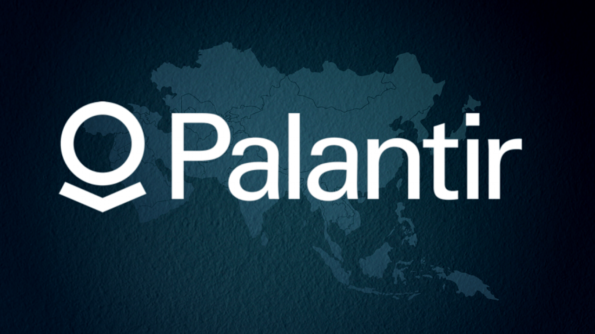

# **PALANTIR TECHNOLOGIES**

## **Overview and Origin**
---

Palantir is a software company that uses big data to help develop specific software platforms taylored to their customers. It was founded by Peter Thiel, Nathan Gettings, Joe Lonsdale, Stephen Cohen, and Alex Karp in 2004.  Peter Thiel was a co-founder of PayPal who saw that they could use PayPals fraud recognition system to help reduce terrorism and financial fraud. During the early investments, Peter Thiel and his venture capital fund contributed $30 million while the CIA contributed an additioanl $2 million.

## **Business Activities:**
---

Palantir's software uses data analytics to help companies understand what is facing whether it be customers, supply chain, or competitors. Palantir is an expensive and an long term investment used to solve complex problems so it is geared towards big companies or governments, rather than small to medium sized businesses. Ever since Palantir has shifted towards the private sector, they differ from their competitors by not only providing a platform specific to the company, but also provides on-site engineers to personally supervise the product, similar to a consulting business. The type of applications that Palantir currently uses are Snowflake, NGINX, Bootstrap, Handlebars.js, Plottable.js, Google Analytics, Varnish, and Salesforce.

## **Landscape:**
---

The first company that worked with Palantir, once they started targeting the private sector, was JP Morgan Chase & Co. While Palantir's technology could help all domains of finance but the Palantir <strong><em>Foundry</em></strong> Product mainly assists global banks and regulators with potential fraud investigations. As data keeps being collected, Palantir can use big data to help solve problems from fraud to helping design a software can trade using algorithms and data points. We have always used data to review financial data; but as of recently, data combined with computing power, can be used to help buy and sell a stock. Since Palantir is a data analytics and software company, their competitors are other data management or software companies like Cognizant, Splunk, or Tableau.

## **Results**
---

Notably Palantir has been able to use Big Data to help governments identify terrorism and even assisted the U.S in finding Osama Bin Laden. In 2020, credit and debit card fraud amounted to about $149 million in losses. With Palantir, they can help decrease the loss in credit card fraud and laundering. <strong><em>Foundry</em></strong> can cut investigative time in half while improving cybersecurity and relationships with regulators.  
<ul>- For Transaction Monitoring, alerts are resolved <b>~60% faster</b> 
- Helped global financial organizations to lower their cost by 90% and improve their true positive rate by 45X 
</ul>

## **Recommendations**
---

 
The current products of Palantir are mainly used for big companies or governments but a great small to medium business product could range from fashion to real estate. This would benefit small businesses where they cannot keep up with corporations. It brings more competition to the market. It would also help expand Palantir's business from mainly Government contracts to the Private Sector. It would still use the same technology except catered to the specific business. Not only that, Palantir Technologies should look more into cybersecurity. Currently their biggest threat, being a big data company, is getting hacked and data breaches. 

 
 

### **SOURCES**
---
 
https://www.palantir.com/offerings/anti-money-laundering/
 
 
https://www.palantir.com/platforms/foundry/ 
 
https://craft.co/palantir-technologies/competitors 
 
https://stackshare.io/palantir-technologies/palantir-technologies 
 
https://en.wikipedia.org/wiki/Palantir_Technologies 

